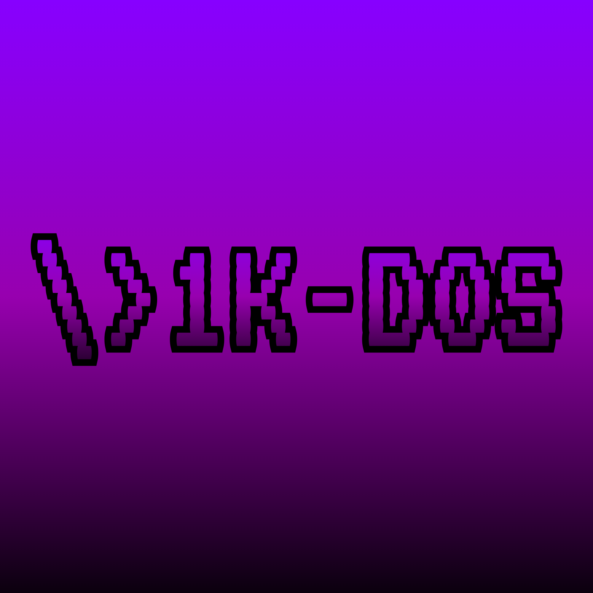

<p align="center">
  
</p>

<h1 align="center">1K-DOS</h1>

<p align="center">
  <a href="https://nasm.us/pub/nasm/releasebuilds/">[ DOWNLOAD NASM ]</a>
  <span> &nbsp; ─── &nbsp; </span>
  <a href="https://www.qemu.org/download/">[ DOWNLOAD QEMU ]</a>
</p>

### ╋━ [DEFINITIVE BRANCH: MID-LEVEL STAGE 2 EDITION] | [VERSION 11.0] | [DEVELOPER: ElPanitaXD] ━╋

#### What is VORTEX DOS?
**VORTEX DOS** is an independent operating system created by **ElPanitaXD**. It is written 100% in assembly language. It has passed the basic 512-byte constraint by implementing a **Two-Stage Bootloader Architecture (Stage 1 Master Boot Record & Stage 2 Operating System Kernel)**, allowing unlimited features and memory scalability.

---

### ⓘ HARDWARE REQUIREMENTS
* **`[+] CPU:`** Any 32-bit or 64-bit x86 processor (Intel/AMD).
* **`[+] RAM:`** **1 Kilobyte of base memory**.
* **`[+] DRIVE:`** 1 Virtual Floppy Disk (Stage 1 Bootloader reading Stage 2 Kernel sectors).
* **`[+] PRIVILEGES:`** Standard User (Does not require Administrator permissions).
* **`[+] PALETTE:`** Black background, Customizable typography color, and an auto-aligned double Yellow top header.
* **`[+] KEYBOARD:`** Localized Latin-American/Spanish layout translation mapping layer.

---

### >_ OPERATOR COMMANDS (MID-LEVEL EDITION)
Type the full command at the `vtx> ` prompt and press **ENTER** to execute:

| COMMAND | MICROPROCESSOR ACTION |
| :--- | :--- |
| **`help`** | Displays the list of authorized commands. |
| **`echo`** | Type `echo ` followed by your message, and the CPU will output a clean text repetition. |
| **`game`** | Advanced Mathematical Firewall (Random 1 to 2-digit addition/subtraction). |
| **`cls`** | Clears the console, realigns the cursor to Col 0/Row 2, preserving the header. |
| **`color`** | Type `color ` followed by `1` (Blue), `2` (Green), `3` (Cyan), `4` (Red), or `5` (White) to change the entire terminal typography dynamically. |
| **`info`** | Renders a high-resolution, custom ASCII text art logo of 1K-DOS and developer details. |
| **`time`** | Queries the motherboard RTC (Real-Time Clock) chip to output the system time (`HH:MM:SS`). |
| **`date`** | Queries the motherboard RTC calendar registers to output the date (`DD/MM/YYYY`). |
| **`shutdown`**| Connects to the BIOS APM (Advanced Power Management) interface to shut down QEMU safely. |
| **`rb`** | Forces a physical system reboot of the QEMU virtual BIOS. |

#### * GAME RULES (MATH LOCK):
When running `game`, the CPU reads the internal system clock to generate a random equation *(e.g., 5 + 5 =)*.
1. Type your answer (supports multi-digit numbers like 10).
2. Press **ENTER** to validate.
3. **Result:** Outputs a styled `[OK] (*^_^*)` in Phosphor Green or a `[ERR] (x_x)` in Fire Red along with a physical motherboard hardware beep (`BEEP`).

---

### </> OPTION B: LOCAL EXECUTION GUIDE (USING CMD & POWERSHELL)
*To compile the multi-file architecture uncorrupted directly from your machine:*

* **STEP 1:** Place your `boot.asm` and `1-K.asm` files directly onto your Windows Desktop.
* **STEP 2:** Open the Windows Command Prompt (`cmd`) and navigate to your Desktop by running:
  ```bash
  cd %userprofile%\Desktop
  ```
* **STEP 3: COMPILE STAGE 1 (BOOTLOADER)**
  Run the following command to generate the 512-byte MBR sector:
  ```bash
  "C:\Users\YOUR_USERNAME\AppData\Local\bin\NASM\nasm.exe" -f bin boot.asm -o boot.bin
  ```
* **STEP 4: COMPILE STAGE 2 (1K-DOS KERNEL)**
  Run the following command to assemble the unconstrained middle-level system core:
  ```bash
  "C:\Users\YOUR_USERNAME\AppData\Local\bin\NASM\nasm.exe" -f bin 1-K.asm -o 1-DOS.bin
  ```
* **STEP 5: BINARY FUSION (IMAGE GENERATION)**
  Run this PowerShell command inside the CMD to bind both files side-by-side into a raw disk image without losing raw bytes:
  ```bash
  powershell -Command "[System.IO.File]::WriteAllBytes('vtx_floppy.img', [System.IO.File]::ReadAllBytes('boot.bin') + [System.IO.File]::ReadAllBytes('1-DOS.bin'))"
  ```
* **STEP 6: BOOTING 1K-DOS IN QEMU**
  Fire up the virtual x86 machine using the following parameters:
  ```bash
  "C:\msys64\ucrt64\bin\qemu-system-x86_64.exe" -drive format=raw,file=vtx_floppy.img,if=floppy
  ```

---

### ⎙ SYSTEM CREDITS
* Source code and Stage 2 operating system infrastructure fully designed in pure x86 Assembly by **ElPanitaXD**.
* Safely backed up on GitHub against unexpected Windows Updates or system context corruptions.

#### Operating System Demonstration:


